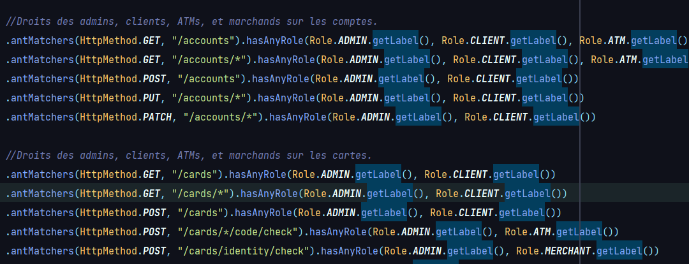
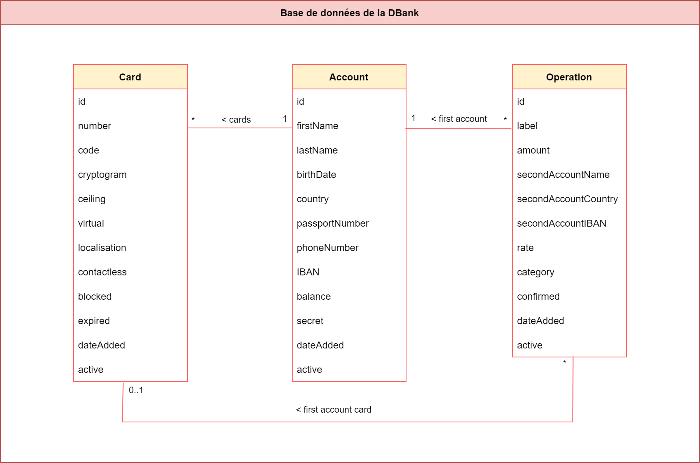

## Solution

API pour effectuer des échanges métier avec la `DBank`.

____
### Sommaire
<ol> 
  <li>
    <a href="#from">
      Auteurs
    </a>
  </li>
  <li>
    <a href="#tech">
      Technologies, librairies, frameworks principaux
    </a>
  </li>
  <li>
    <a href="#install">
      Installation et exécution
    </a>
  </li>
  <li>
    <a href="#description">
      Description globale
    </a>
  </li>
  <li>
    <a href="#functions">
      Règles de gestion et fonctionnalités
    </a>
  </li>
  <li>
    <a href="#db">
      Conception et base de données
    </a>
  </li>
  <li>
    <a href="#software">
      Architecture logicielle
    </a>
  </li>
  <li>
    <a href="#example">
      Exemple d'utilisation
    </a>
  </li>
</ol>

____

### Auteurs
CHEVRIER Jean-Christophe

____

### Technologies, librairies, frameworks principaux

- `Java 17`
- `H2`
- `Maven`
- `Spring Boot`
- `Keycloak`

____

### Installation et exécution

- Télécharger et installer `Java 17`
(si vous ne l'avez pas déjà).

- Télécharger et installer `Keycloak`
(si vous ne l'avez pas déjà).

- Lancer le serveur Keycloak.
Pour le lancer en local, aller dans le répertoire de `Keycloak`, et lancer `bin\standalone.bat`
ou `bin/standalone.sh` selon votre OS.

- Importer sur Keycloak la configuration `keycloak/configuration.json`,
présente sur le répertoire `GitHub` du projet.

- Créer des utilisateurs sur Keycloak, pour
les différents rôles existants : `Admin`,
`Client`, `ATM`, `Merchant`.

- Lancer l'API avec les exécutables du projet :
`dbank_api.bat` ou `dbank_api.sh` selon votre OS (les exécuter dans leur répertoire respectif). Au lancement des exécutables,
la base de données est automatiquement peuplée avec des exemples d'opérations,
de cartes, et de comptes.

____

### Description globale

Cette API permet la communication avec la `DBank` ou `Digital Bank`,
qui est une banque numérique fictive inventée pour le projet.

Cetet banque numérique `DBank` peut être comparée à des applications telles que `Revolut.com`.

L'API permet l'échange avec 4 types de rôle bien déterminés :

- `Admin` : rôle des personnes ou des logiciels internes de la `DBank`, exerçant des
  actions sur les données de la banque, sans aucunes limitations.

- `Client` : rôle des clients ou des applications mobiles des clients de la `DBank`, via lesquelles les clients
  effectuent des actions sur leurs données : virement, changement de numéro de téléphone, demande de nouveau compte, ou
  de nouvelle carte, gestion des plafonds de leurs cartes, blocage de leurs cartes, etc.

- `ATM` : GAB en français : Guichet Automatique Bancaire, ce rôle correspond aux accès des distributeurs automatiques,
  qui interrogent l'API pour différentes actions, telles que vérifier le code d'une carte ou retirer de l'argent
  sur un compte, voir les dernières opérations, etc.

- `Merhant` : marchand en français, ce rôle correspond aux accès des sites de e-commerce, qui communiquent avec l'API
  pour vérifier les informations d'une carte, ou encore réaliser des opérations bancaires / transactions.

<b>Remarque TRES importante</b> : comme vous venez de le lire, un rôle peut donc correspondre à une personne humaine, 
<b>tout comme à un logiciel client de l'API</b>.

___

### Règles de gestion et fonctionnalités

Voici ce qu'il faut savoir pour la gestion l'API en fonction des rôles, <b>dans les grandes lignes</b> :
- Un `Admin` a accès a toutes les fonctionnalités de l'API, et les vues
que lui renvoie l'API contiennent plus d'informations que pour les autres rôles.
En effet, certaines informations ne sont visibles que pour certains rôles.
Un `Admin` a aussi certaines fonctionnalités qui lui sont réservées comme le fait de confirmer 
les opérations, ou de faire expirer les cartes.

- Un `Client` a accès à ses comptes, à ses cartes, et à ses opérations, il peut 
 les lister, les filtrer, les consulter. Pour ce qui est de la modification, cela
dépend, si c'est une opération par exemple, il ne peut pas la modifier.
Il ne peut rien supprimer.

- Un `ATM` peut vérifier le code d'une carte, lister les opérations d'un compte, filtrer
  les comptes en fonction de leurs informations, et obtenir les informations d'un compte.

- Un `Merchant` peut vérifier les informations d'une carte, consulter, ajouter, et supprimer 
  des opérations. Etant un acteur extérieur, `DBank` restreint fortement ses droits par sécurité.

La suppression sur l'API n'est possible que sur les opérations, les cartes
et les comptes ne peuvent pas être supprimées.

Ci-dessous une capture d'écran partielle de la répartition des droits dans la classe `src/[...]/dbank_api/Security/Configuration.java` :

 
Etc...

___

### Conception et base de données

Ci-après vous pouvez voir le diagramme de classes qui a été réalisé
pour concevoir la base de données l'API :

Remarques importantes :
- L'attribut `active` des tables a été prévu au départ pour modéliser la suppression des données dans la banque. Ce qu'il faut comprendre, c'est que les données ne sont jamais vraiment supprimées, elles ne sont jamais que passées à inactives via cet attribut.
- La table `Operation` représente les opérations mais également les virements / transferts, tout a été prévu dans la même table pour ce qui est des échanges entre comptes.
- Une opération est liée à un compte et peut aussi être liée en plus également à une carte précise du compte, cela dépend de l'opération, selon si elle a été réalisée 
  via une carte bancaire ou entre IBANs directement.
- L'attribut `dateAdded` des tables, date d'ajout en français, sert à faire en sorte que toute forme de donnée soit horodatée dans la base 
  de données.
- L'attribut `secret` dans la table `Account`, sert à connaitre l'utilisateur de Keycloak associé au compte bancaire.
- L'attribut `code` dans la table `Card` désigne le code de la carte, et est stocké de manière haché dans la base de données.
- Dans la table `Operation`, `firstAccount` désigne le compte dans l'opération qui est déclaré dans la `DBank`, 
 et  `secondAccount...` désigne le second compte qui peut aussi être déclaré dans la `DBank`, mais qui peut également être un compte
d'une autre banque.

___

### Architecture logicielle

Les sources du projet sont réparties selon cette arborescence :

      src/[...]/dbank_api

          assembler/      Répertoire des classes implémentant HATEOAS dans le projet.
          controller/     Répertoire des classes de traitement des requêtes HTTP en fonction 
                          demandes, rôles, etc.
          dto/            Répertoire des objets échangés entre l'API et les logiciels clients :
                          saisies et vues pour chaque entité.
          entity/         Répertoire des entités / structures de données de la banque.
          exception/      Répertoire des exceptions utilisées par les contrôleurs pour la bonne
                          réponse aux demandes.
          mapper/         Répertoire des classes de mapping entre les DTOs (saisies, vues) et les entités.
          repository/     Répertoire des classes pour l'interrogation de la base de données H2.
          security/       Répertoire des classes gérant la sécurirté dans le projet, référenciation des
                          URIs de l'API par rôle, etc.
          validator/      Répertoire des validateurs manuels des entités.

___

### Example d'utilisation

Ci-dessous un exemple d'utilisation.

Obtention d'un `Bearer Token` de `Keycloak` pour notre utilisateur "admin" de rôle `Admin` :

Recherche des comptes bancaires de Mario Aliti en tant que l'utilisateur Admin
(on renseigne son token) :
...

Réponse de `DBankAPI` :

